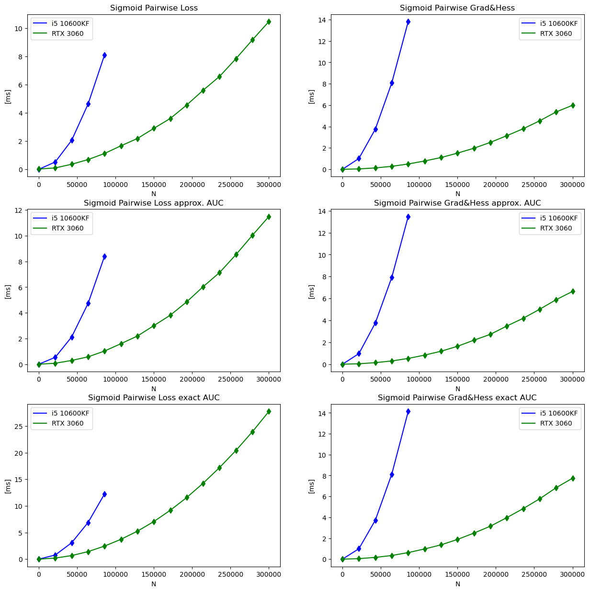

# RocAuc Pairwise custom objective for gradient boosting
 This is GPU implementation of rocauc pairwise objective for gradient boosting:
$$L = \sum_{i, j} \left(\hat P_{ij}\log{P_{ij}} + (1 - \hat P_{ij})\log{(1 - P_{ij})}\right)\lvert \Delta_{AUC_{ij}}\vert$$
Where:
$$P_{ij} = \frac{1}{1 + e^{-(x_i - x_j)}} $$
This package could be used to solve classification problems with relative small numbers of objects, where you need to improve rocauc score. \
Also there is cpu multithread implementation of this objectives and losses.
## Objectives that are implemented in this package
1. **Sigmoid pairwise loss.** (GPU or CPU implementations)
$$L = \sum_{i, j}\hat P_{ij}\log{P_{ij}} + (1 - \hat P_{ij})\log{(1 - P_{ij})}$$
2. **RocAuc Pairwise Loss** with approximate auc computation. (GPU or CPU implementations)
$$L = \sum_{i, j} \left(\hat P_{ij}\log{P_{ij}} + (1 - \hat P_{ij})\log{(1 - P_{ij})}\right)\lvert \Delta_{AUC^{approx}_{ij}}\vert$$
3. **RocAuc Pairwise Loss Exact** (GPU or CPU implementations) with exact auc computation. This could be more compute intensive, but this loss might be helpfull for first boosting rounds (if you are using gradient boosting)
$$L = \sum_{i, j} \left(\hat P_{ij}\log{P_{ij}} + (1 - \hat P_{ij})\log{(1 - P_{ij})}\right)\lvert \Delta_{AUC^{exact}_{ij}}\vert$$
4. **RocAuc Pairwise Loss Exact Smoothened** (GPU or CPU implementations). This loss allows you to incorporate information about equal instances. Because $\Delta_{AUC_{ij}} = 0$ if $y_i = y_j$. So we just add small $\epsilon > 0$ in equation.
$$L = \sum_{i, j} \left(\hat P_{ij}\log{P_{ij}} + (1 - \hat P_{ij})\log{(1 - P_{ij})}\right)(\epsilon + \lvert \Delta_{AUC^{exact}_{ij}}\vert)$$
## Installation
You can use pip to install this package.
```
pip install roc_auc_pairwise
```

**Project page on PyPI** - roc_auc_pairwise 

## Basic usage examples.
A simple example exact objective function for lightgbm booster.
```
def sigmoid_pairwise_loss_auc_exact(preds, train_data, device):
    y = train_data.get_label()
    
    # !!!Important!!! gpu kernel accepts only single precision floats and int32_t integers
    y = np.array(y, dtype=np.int32)
    preds = np.array(preds, dtype=np.float32)
    
    global N
    
    # First boosting round has to be with sigmoid pairwise loss, 
    # because with all same y_pred deltaauc will be always zero, and grad, hess would be 0 too
    if N == 0:
        if device == 'cpu':
            grad, hess = sigmoid_pairwise_diff_hess_gpu_py(y, preds)
        else:
            grad, hess = sigmoid_pairwise_diff_hess_py(y, preds)
        N = 1
    else:
        if device == 'cpu':
            grad, hess = sigmoid_pairwise_diff_hess_auc_exact_cpu_py(y, preds)
        else:
            grad, hess = sigmoid_pairwise_diff_hess_auc_exact_gpu_py(y, preds)
    return -grad, -hess
```

### For more information 
- You can see example notebook:
```./examples/gradient_boosting_example.ipynb```
- Or you can use example notebook on [Google Colab](https://colab.research.google.com/drive/1w7BN0XGjB5vgFp2pbiCaejabc91xWmI0?usp=sharing)
- Or you can use example notebook on [Kaggle](https://www.kaggle.com/code/michailindmitry/gradient-boosting-roc-auc-pairwise-example-ipynb)

## Performance
Losses, Gradients and Hessians are require $\mathcal{O}(n^2)$ to compute. So it is very compute intensive.\
Here you can see package perfomance on Intel Core i5 10600KF and Nvidia RTX 3060.
\


## References
[1] Sean J. Welleck, Efficient AUC Optimization for Information Ranking Applications, IBM USA (2016) <br />
[2] Burges, C.J.: From ranknet to lambdarank to lambdamart: An overview. Learning (2010) <br />
[3] Calders, T., Jaroszewicz, S.: Efficient auc optimization for classification. Knowledge
Discovery in Databases. (2007)
